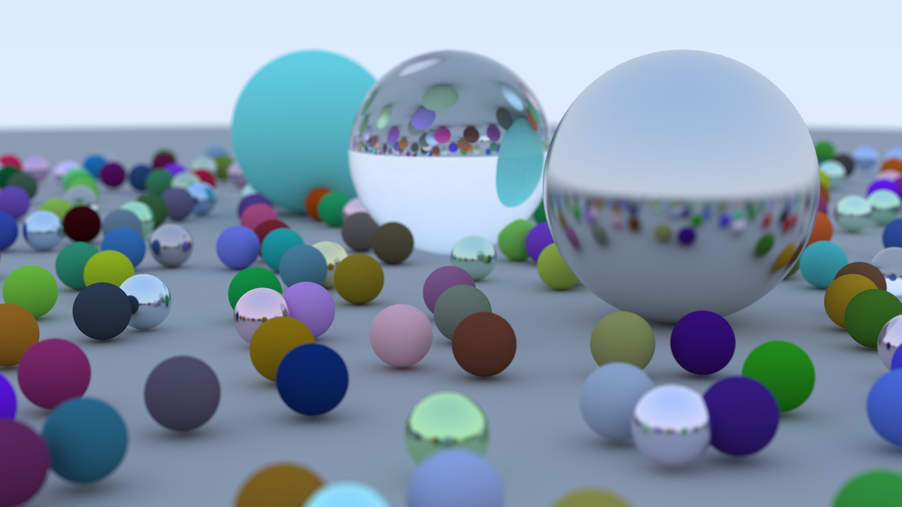

# Ray Tracing in One Weekend



This project is a Rust implementation of [_Ray Tracing in One Weekend_](https://raytracing.github.io/books/RayTracingInOneWeekend.html).

## Original work
- Original Authors: Peter Shirley, Trevor David Black, Steve Hollasch
- Original Site: https://raytracing.github.io/

## How to Run
```rust
cargo run --release > image.ppm
```
